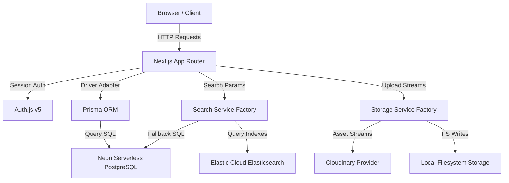

# CompensaIQ — Employee Salary Management Software

An enterprise-grade, high-performance Salary Management System built with Next.js 16, Prisma ORM, Neon serverless PostgreSQL, Auth.js (v5), Groq AI, and Elastic Cloud (Elasticsearch) with direct PostgreSQL fallback.

---

## 1. Project Overview

### Purpose
CompensaIQ is designed to replace fragile, slow, and security-vulnerable spreadsheets used by HR teams to manage compensation data. It provides a secure, consolidated platform for managing organizational salaries, conducting audit-logged updates, defining compensation bands, tracking compa-ratios, and executing complex, plain-English payroll queries.

### Problem Statement
As organizations grow to 10,000+ employees, managing compensation spreadsheets leads to:
1.  **Data Loss & Auditing Failures**: Overwriting historical salary records instead of appending edits prevents compliance tracing.
2.  **Performance Exhaustion**: Browsers crash when rendering tables of 10k+ rows without virtualization or pagination.
3.  **Security Risks**: Exposing raw database SQL to natural language queries allows prompt injection and data exfiltration.
4.  **Exchange Rate Drift**: Out-of-date currency comparisons make global equity parity impossible to calculate.

### Target Users
*   **HR Managers & Compensation Specialists**: Need to execute audits, update roles/salary structures, upload bulk new hires, and review pay equity.
*   **CFOs & Budget Planners**: Need instant, grounded payroll aggregates and cost trajectories.

### Core Goals
*   Provide sub-100ms search, filter, and page transitions across 10,000+ employees.
*   Maintain an immutable, append-only ledger for all salary revisions and audit logs.
*   Implement a double-pass LLM query routing assistant that prevents database injection.

---

## 2. Product Demo & Screenshots

### Product Demo & Links
*   **Live SaaS Application**: [https://salary-management-system-teal.vercel.app/login](https://salary-management-system-teal.vercel.app/login)
*   **Walkthrough Video**: [/demo/video/product-demo.mp4](file:///e:/salary-management-system/demo/video/product-demo.mp4)

### Screenshot Gallery
*   **Executive Dashboard**: [demo/screenshots/dashboard.png](file:///e:/salary-management-system/demo/screenshots/dashboard.png)
*   **Virtualized Directory**: [demo/screenshots/employees.png](file:///e:/salary-management-system/demo/screenshots/employees.png)
*   **Salary Timeline**: [demo/screenshots/employee-details.png](file:///e:/salary-management-system/demo/screenshots/employee-details.png)
*   **Workforce Analytics**: [demo/screenshots/analytics.png](file:///e:/salary-management-system/demo/screenshots/analytics.png)
*   **Document Management**: [demo/screenshots/documents.png](file:///e:/salary-management-system/demo/screenshots/documents.png)
*   **Client CSV Parser**: [demo/screenshots/upload.png](file:///e:/salary-management-system/demo/screenshots/upload.png)
*   **Secure Authentication**: [demo/screenshots/login.png](file:///e:/salary-management-system/demo/screenshots/login.png)

---

## 3. Technology Stack

*   **Frontend**: React 19, Next.js 16 (App Router with Turbopack), Framer Motion, Recharts
*   **Backend**: Next.js Server Components, API Route Handlers
*   **Database**: Neon Serverless PostgreSQL
*   **ORM**: Prisma ORM v7 (Driver-adapter based architecture)
*   **Authentication**: Auth.js v5 (Credentials Provider, RBAC via session tokens)
*   **Search**: Elastic Cloud (Elasticsearch v8) with direct PostgreSQL fallback
*   **Storage Provider**: Cloudinary (Production) / Local ephemeral filesystem storage (Local Fallback)
*   **AI Integration**: Groq API (Llama 3 classification and grounding)
*   **Testing**: Vitest v4, `@testing-library/react`
*   **Virtualization**: Custom React row virtualization

---

## 4. Project Structure

```bash
├── .github/workflows/       # GitHub Actions CI pipeline
├── app/
│   ├── api/                 # REST API routes (employees, bulk actions, pay-query, documents)
│   ├── app/                 # Next.js App Router views (analytics, directory, org-chart, audit-log)
│   └── globals.css          # Tailwind CSS tokens and themes
├── components/              # Shared React components
│   └── ui/                  # Reusable UI elements (DataTable, CustomSelect, Sidebar)
├── lib/
│   ├── prisma.ts            # Client instantiation with Neon driver adapters
│   ├── cache.ts             # Ephemeral metadata caching layer
│   ├── search/              # Search service interfaces and implementations (Postgres/ES)
│   ├── storage/             # Storage providers (Cloudinary/Local)
│   └── validations/         # Zod API validation schemas
├── prisma/                  # Prisma schemas and migration scripts
├── scripts/                 # Index sync and database seeding scripts
├── test/                    # Vitest unit and integration tests
├── Dockerfile               # Multi-stage production container build
└── docker-compose.yml       # Local database and app orchestration config
```

For detailed folder and layout diagrams, see [artifacts/architecture_and_design.md](file:///e:/salary-management-system/artifacts/architecture_and_design.md).

---

## 5. Architecture Overview

CompensaIQ is divided into decoupled service layers to ensure separation of concerns and high-availability:



*   **Database Fallback**: If Elasticsearch encounters timeouts, the search router seamlessly falls back to PostgreSQL indexed query executions.
*   **Safe AI Grounding**: Natural language queries go through an LLM classification pass to extract safe query parameters. These parameters drive pre-compiled SQL queries, completely eliminating SQL injection risks.

---

## 6. Scalability Strategy

To scale seamlessly from **10,000** to **1,000,000+** employees:
1.  **Cursor-Based Pagination**: Employs base64-encoded search cursor arrays (`search_after` in Elasticsearch, primary keys in PostgreSQL) instead of offset limits, keeping query speeds constant.
2.  **DOM Virtualization**: Renders only the visible rows inside the viewport, reducing DOM node memory overhead by 95%.
3.  **Distributed Queues**: Bulk CSV uploads and indexing actions can be offloaded to task queues (e.g. Redis + BullMQ) to avoid serverless function timeouts.

For complete scaling analyses, refer to [artifacts/scalability_and_performance.md](file:///e:/salary-management-system/artifacts/scalability_and_performance.md).

---

## 7. Security & Compliance

*   **Strict Parameter Whitelisting**: LLM output parameters are validated against a strict runtime whitelist to block injection.
*   **Authentication & RBAC**: Session cookies restrict document modifications to authenticated `HR_ADMIN` roles.
*   **Immutable Audit Logging**: Every create, update, or delete transaction writes the user identity, timestamps, and full before/after snapshots to the audit log.

For a detailed security audit, see [artifacts/architecture_and_design.md#security](file:///e:/salary-management-system/artifacts/architecture_and_design.md#security).

---

## 8. Performance Optimizations

*   **Composite Indexing**: Compound indexing on `(isActive, department, level, country)` optimizes multi-field filter scans.
*   **Debounced Inputs**: Search inputs are debounced (200ms) to reduce API load.
*   **Virtual Lists**: Prevent browser layout calculation lag on large tables.

For exact benchmarks and execution analysis, review [artifacts/scalability_and_performance.md](file:///e:/salary-management-system/artifacts/scalability_and_performance.md).

---

## 9. Deployment & Execution

### Local Setup
1. Copy `.env.example` to `.env` and configure keys.
2. Install dependencies: `pnpm install`
3. Generate client: `pnpm prisma:generate`
4. Migrate database: `npx prisma migrate dev --name init`
5. Seed database: `pnpm prisma:seed`
6. Start dev server: `pnpm dev`

### Production Runbook
Refer to [DEPLOYMENT_RUNBOOK.md](file:///e:/salary-management-system/DEPLOYMENT_RUNBOOK.md) for Neon PostgreSQL, Elastic Cloud, and Vercel hosting guidelines.

### Docker Environment
```bash
docker-compose up --build
```

---

## 10. Architectural Decision Records (ADRs)

Detailed records of engineering tradeoffs and framework choices:
*   [ADR-001: Framework Choice](file:///e:/salary-management-system/artifacts/adr/adr-001-framework.md)
*   [ADR-002: Neon PostgreSQL Database](file:///e:/salary-management-system/artifacts/adr/adr-002-database.md)
*   [ADR-003: Search Architecture](file:///e:/salary-management-system/artifacts/adr/adr-003-search-architecture.md)
*   [ADR-004: Storage Provider Abstraction](file:///e:/salary-management-system/artifacts/adr/adr-004-storage-provider.md)
*   [ADR-005: Pagination Strategy](file:///e:/salary-management-system/artifacts/adr/adr-005-pagination-strategy.md)
*   [ADR-006: Virtualization](file:///e:/salary-management-system/artifacts/adr/adr-006-virtualization.md)
*   [ADR-007: Authentication & RBAC](file:///e:/salary-management-system/artifacts/adr/adr-007-authentication.md)
*   [ADR-008: Document Management](file:///e:/salary-management-system/artifacts/adr/adr-008-document-management.md)
*   [ADR-009: Future Scalability](file:///e:/salary-management-system/artifacts/adr/adr-009-scalability-strategy.md)

---

## 11. AI-Assisted Development

*   Prompts, output validations, and manual code corrections are documented in [artifacts/ai/ai_usage.md](file:///e:/salary-management-system/artifacts/ai/ai_usage.md).

---

## 12. Testing

Run the test suite containing unit, integration, and mock search fallback assertions:
```bash
npx vitest run
```
Tests are located in the [test/](file:///e:/salary-management-system/test/) folder.

---

## 13. License
Distributed under the MIT License. See `LICENSE` for details.
