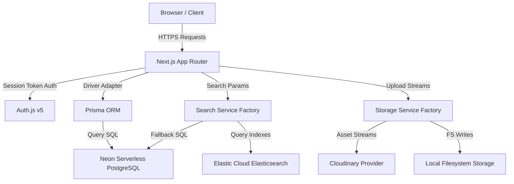
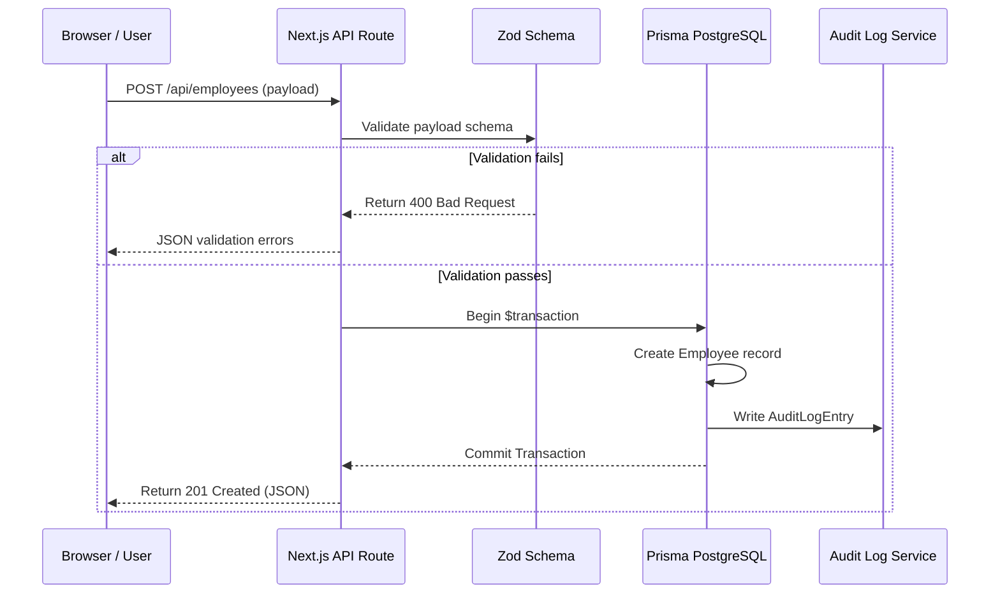
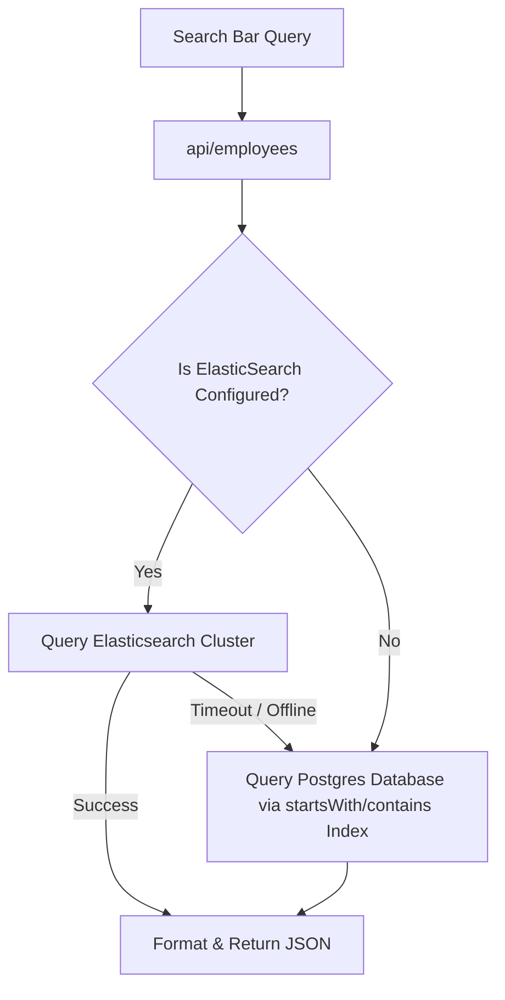
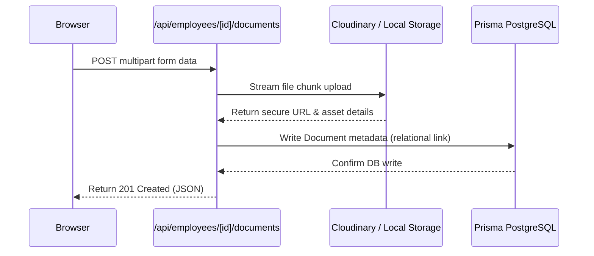
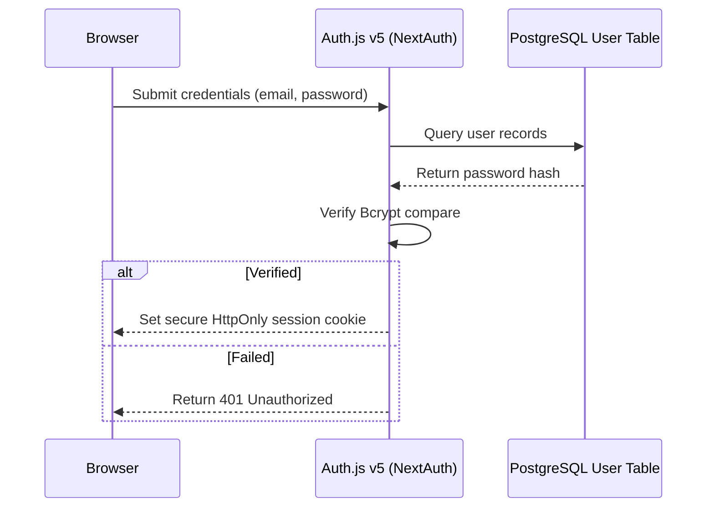

# Architecture & Technical Design Blueprint
**Artifact: architecture_and_design.md**

---

## 1. High-Level Architecture

The system uses Next.js App Router for frontend rendering (Server and Client components) and REST API route handlers. The backend leverages services for storage abstraction and search indexing fallback.



---

## 2. Dynamic Flow Diagrams

### Request Flow


### Search Flow (Fallback Routing)


### Document Upload Flow


### Authentication Flow


---

## 3. Database Schema Design (Entity Relationship Diagram)

```mermaid
erDiagram
    User {
        string id PK
        string email UNIQUE
        string passwordHash
        string role
        string employeeId FK
    }
    Employee {
        string id PK
        string name
        string employeeCode UNIQUE
        string department
        string level
        string country
        boolean isActive
        datetime startDate
        string managerId FK
    }
    SalaryRecord {
        string id PK
        string employeeId FK
        float baseAmount
        string currency
        float bonusAmount
        float baseAmountUSD
        float bonusAmountUSD
        datetime effectiveDate
    }
    Document {
        string id PK
        string employeeId FK
        string title
        string fileUrl
        string categoryId FK
        boolean isConfidential
        datetime expiresAt
    }
    DocumentCategory {
        string id PK
        string name UNIQUE
    }
    AuditLogEntry {
        string id PK
        string actorLabel
        string action
        string entityType
        string entityId
        json beforeValue
        json afterValue
        datetime timestamp
    }

    Employee ||--o| User : "has account"
    Employee ||--o| Employee : "reports to (manager)"
    Employee ||--o{ SalaryRecord : "has salary history"
    Employee ||--o{ Document : "has documents"
    DocumentCategory ||--o{ Document : "categorizes"
```

---

## 4. API Endpoints Specification

| Method | Endpoint | Request Body | Headers | Response Status | Description |
| :--- | :--- | :--- | :--- | :--- | :--- |
| **GET** | `/api/employees` | None | Cookie Session | 200 / 401 | Retrieve paginated directory list |
| **POST** | `/api/employees` | `CreateEmployeeSchema` | Cookie Session | 201 / 400 / 401 | Create a new employee & write audit log |
| **PATCH** | `/api/employees/[id]` | `UpdateEmployeeSchema` | Cookie Session | 200 / 400 / 404 | Update details & sync indexes |
| **DELETE** | `/api/employees/[id]` | None | Cookie Session | 200 / 404 / 500 | Cascade delete references & clear index |
| **POST** | `/api/employees/bulk-import` | Array of employees | Cookie Session | 201 / 400 | Transactional CSV import |
| **POST** | `/api/pay-query` | `{ question: string }` | Cookie Session | 200 / 400 / 500 | Groq NL query analysis endpoint |
| **POST** | `/api/employees/[id]/documents` | Multipart form file | Cookie Session | 201 / 400 | Stream upload a file to cloud storage |

---

## 5. Security & Compliance Controls

1.  **SQL Injection Protection**: Whitelisting dynamic inputs:
    ```typescript
    const allowed = ["department", "country", "level"];
    if (!allowed.includes(dimension)) throw new Error("Unauthorized dimension query");
    ```
2.  **Cross-Site Scripting (XSS)**: Document viewer binds files into native browser HTML5 `<object type="application/pdf">` tags, bypassing any executable script tags.
3.  **Audit Logs**: Append-only transaction snapshots detailing user edits are stored as JSON blobs, providing compliance tracing.
